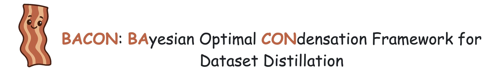

Page of BACON: Bayesian Optimal Condensation Framework for Dataset Distillation

**Page**: [https://zhouzhengqd.github.io/bacon.page/](https://zhouzhengqd.github.io/bacon.page/).

**Code**: [https://github.com/zhouzhengqd/BACON](https://github.com/zhouzhengqd/BACON).

**Paper:** [https://arxiv.org/pdf/2406.01112](https://arxiv.org/pdf/2406.01112).

## Abstract

> **Abstract**: <u>**BACON**</u> (<u>**BA**</u>yesian Optimal <u>**CON**</u>densation Framework) introduces a Bayesian framework to Dataset Distillation (DD), offering a principled probabilistic approach that addresses the lack of theoretical grounding in existing methods. By formulating DD as a Bayesian optimization problem, BACON derives a numerically tractable lower bound on expected risk, facilitating efficient data synthesis. Evaluated on multiple image classification benchmarks, BACON consistently outperforms state-of-the-art methods, achieving significant accuracy gains while reducing both synthesis and training costs.
